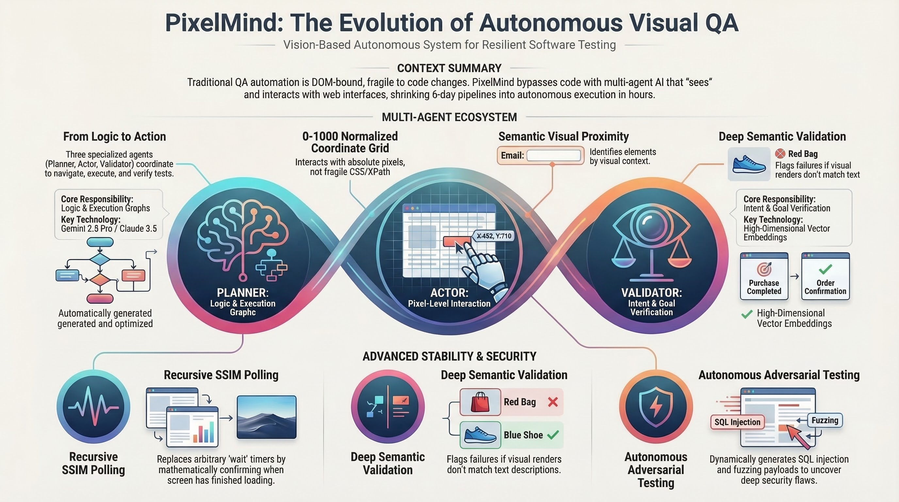

# Product Requirements Document (PRD): PixelMind

## 1. Executive Summary & Vision
PixelMind is an autonomous, perceptual AI testing framework designed to transcend the limitations of traditional DOM-bound automation. By humanizing the QA process, PixelMind interacts with web interfaces visually, eliminating the fragility caused by HTML or Shadow DOM restructures.

**The Vision:** A zero-maintenance testing engine that perceives, reasons, and acts on any web application using high-capacity multimodal models and spatial awareness.

---

## 2. Multi-Agent Architecture
The framework employs a specialized multi-agent orchestration layer to ensure high accuracy and visual reliability.

| Agent | Model | Responsibility |
| :--- | :--- | :--- |
| **Planner** | `gemini-3-flash-preview` | Ingests goals and visual state to construct a sequenced execution plan. |
| **Actor** | `gemini-3-flash-preview` | Translates logical steps into precise actions on a **0-1000 normalized coordinate grid**. |
| **Validator** | `gemini-3-flash-preview` | Performs comparative analysis between "Before" and "After" states to confirm intent. |

---

## 3. Core Technical Capabilities

### Perceptual Reasoning & Stability
*   **Recursive SSIM Polling**: Bypasses arbitrary sleep timers by using the **Structural Similarity Index Measure (SSIM)** to confirm UI stability before and after actions.
*   **Normalized Spatial Interaction**: Maps actions to a universal 0-1000 coordinate system, ensuring browser-agnostic precision and resolution independence.
*   **Semantic Visual Context**: Prioritizes visual labels and spatial proximity over fragile CSS/XPath selectors.

### Semantic Validation Layer
*   **High-Dimensional Verification**: Utilizes **`gemini-embedding-001`** to convert source intent and destination page content into vector embeddings.
*   **Cosine Similarity Thresholds**: Flags "High-Risk Routing Failures" if the semantic similarity between the expected outcome and actual page content falls below a defined threshold (e.g., < 0.70).
*   **Multi-Modal Mismatch Detection**: Architected to catch visual/textual discrepancies (e.g., text describes "Red Bag" but image shows "Blue Shoe").

---

## 4. Security & Autonomous Testing
PixelMind includes an **Adversarial Generator** to stress-test applications without manual test case design:
*   **Context-Aware Fuzzing**: Generates real-time payloads (SQLi, XSS, Boundary values) based on the identified field types.
*   **UI Collapse Detection**: Monitors for visual regressions or state collapses during adversarial inputs.

---

## 5. Enterprise Integrations (MCP)
The framework bridges AI reasoning to enterprise workflows via the **Model Context Protocol (MCP)**:
*   **Jira ADF Mapping**: The Validator Agent autonomously maps raw JSON test failures into **Atlassian Document Format (ADF)** for direct Jira ticket creation.
*   **Intelligent Severity Triage**: Categorizes defects (Blocker, Major, Minor) based on the qualitative impact analyzed by the Validator.

---

## 6. Project Structure & Roadmap
1.  **Phase 1 (Complete)**: Core Agent loop with Playwright integration and SSIM polling.
2.  **Phase 2 (Complete)**: Visual dashboard and real-time execution reporting.
3.  **Phase 3 (Active)**: Deepening adversarial payloads and multi-page discovery sweeps.
4.  **Phase 4 (Targeted)**: Production-scale parallel execution and full MCP Jira/Slack integration.
