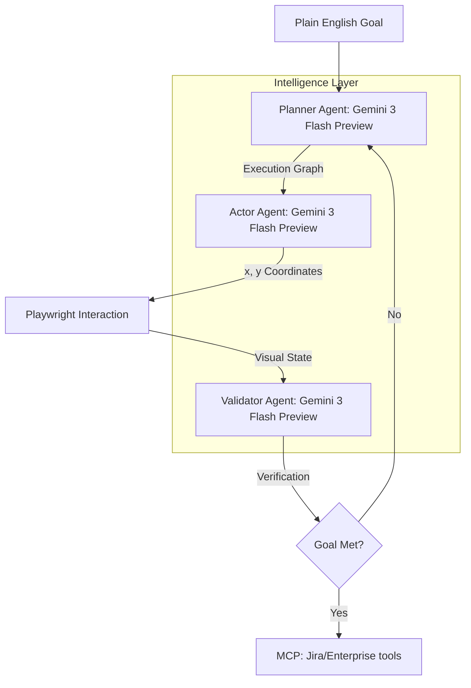
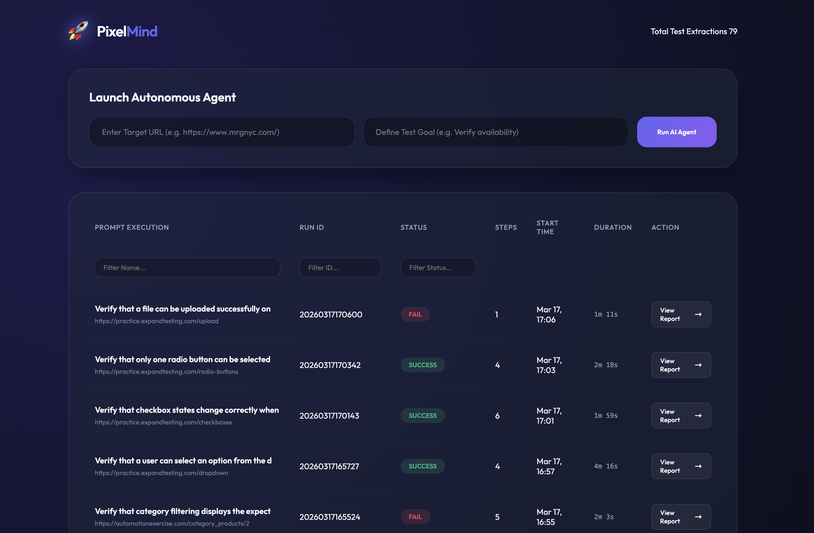
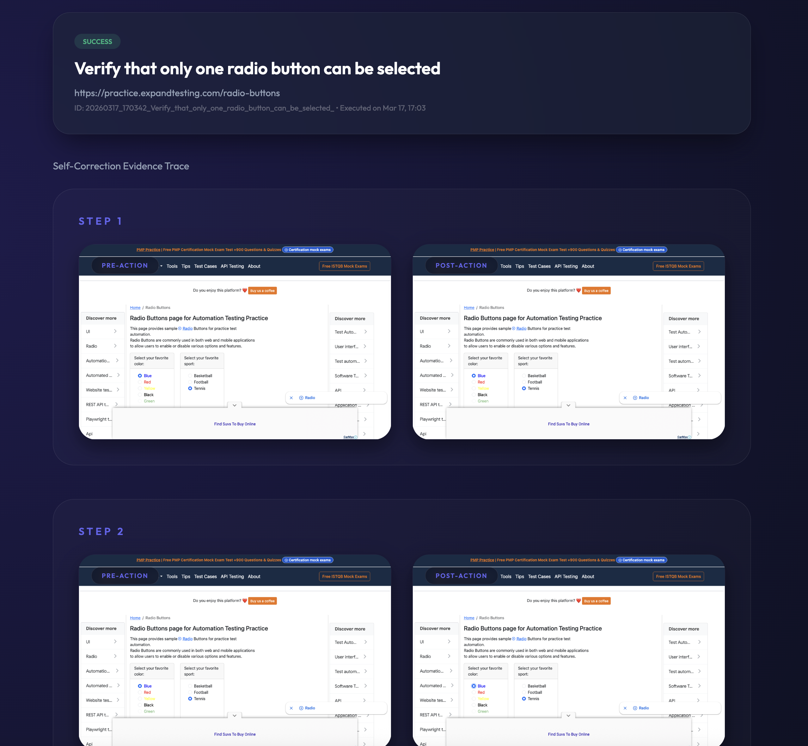

# 🤖 PixelMind: Perceptual AI Web Automation

[](https://www.python.org/downloads/)
[](https://playwright.dev/)
[](https://cloud.google.com/vertex-ai)
[](https://opensource.org/licenses/MIT)

PixelMind is a state-of-the-art, **perceptual AI testing framework** that interacts with web interfaces exactly as a human does—visually. By combining high-capacity reasoning models with a custom multi-agent orchestration layer, it autonomously navigates, tests, and reports on any digital asset with zero reliance on brittle DOM selectors.

---

## 🏗 Multi-Agent Architecture

The framework operates via a sophisticated orchestration of specialized AI agents, each powered by the latest Gemini 3 Flash Preview models.



### Core Components
- **Planner Agent (Gemini 3 Flash Preview)**: Ingests the high-level goal and visual state to construct a deterministic execution graph.
- **Actor Agent (Gemini 3 Flash Preview)**: Translates logical steps into a $0-1000$ normalized coordinate grid for pixel-perfect execution.
- **Validator Agent (Gemini 3 Flash Preview)**: Analyzes the resulting visual state and destination URLs to confirm qualitative intent was met.
- **MCP Middleware**: Bridges the AI agents directly to enterprise tools (Jira, Slack, etc.), ensuring autonomous defect reporting.

---

## 🌟 Key Innovations

- **Computer Use API Implementation**: Native integration for visual-spatial reasoning.
- **SSIM Polling**: Continuous visual polling that captures successive screenshots to confirm UI stability without arbitrary waits.
- **Semantic Proximity**: Bypasses the DOM entirely, identifying elements via visual proximity (e.g., linking a label to its adjacent input box).
- **High-Dimensional Validation**: Flagging routing failures if the **Cosine Similarity** between intent and outcome falls below $0.70$.

---

## 📊 Dashboard & Visual Reporting

PixelMind provides comprehensive observability into the AI agent's decision-making process through real-time dashboards and detailed execution traces.

### Run Explorer Dashboard
The Run Explorer tracks all active and historical test sessions, providing high-level metrics and direct access to detailed reports.



### Annotated Execution Trace
Every test run generates a full visual audit trail, including pre/post-action screenshots and reasoning logs for every interaction.



---

## 🚀 Getting Started

### 1. Prerequisites
- **Python 3.12+**
- [Poetry](https://python-poetry.org/) (Dependency management)
- Google Cloud Project with **Vertex AI** enabled.

### 2. Installation
```bash
# Clone the repository
git clone https://github.com/mbettan/PixelMind.git
cd PixelMind

# Install dependencies
poetry install

# Install Playwright browsers
poetry run playwright install --with-deps chromium
```

### 3. Environment Configuration
Create a `.env` file in the root directory:
```env
PROJECT_ID=your-gcp-project-id
LOCATION=us-central1
GCP_JSON_PATH=path/to/your/credentials.json # If not using ADC
```

---

## 🛠 Usage

### 📊 The Interactive Dashboard
Run the platform to access the premium, glassmorphic "Run Explorer" dashboard.

```bash
poetry run python src/server.py
```
Visit `http://localhost:8000` to:
- **Trigger Runs**: Input a URL and Goal and watch the AI work live.
- **Analyze Results**: View high-fidelity screenshot traces and annotated reasoning logs.
- **Filter History**: Sort and search through historical extraction runs.

### 🧪 Running E2E Tests
The framework includes a suite of real-world test scenarios to verify its own stability.

```bash
# Run all end-to-end scenarios
poetry run pytest tests/test_e2e.py -v -m e2e
```

---

## 📁 Project Structure

```text
PixelMind/
├── dashboard/          # Interactive web interface
├── docs/               # Showcase landing page
├── src/
│   ├── agents/         # AI Logic (Planner, Actor, Validator)
│   ├── engine/         # Interaction & Computer Use logic
│   ├── server.py       # FastAPI dashboard backend
│   └── utils/          # Perceptual utilities (SSIM, Vision)
├── tests/              # End-to-end test scenarios
└── pyproject.toml      # Project configuration
```
